# EsyRent — Sistema de Administración de Propiedades en Alquiler

## Especificación de Requerimientos de Software (SRS)
**Versión 1.0 (Aprobada)**  
**Realizado por:** Jose Luis Burbano Buchelly  
**Materia:** Programación Orientada a Objetos  
**Institución:** Universidad Cooperativa de Colombia  
**Fecha:** 26 de abril de 2026  

---

## 1. Introducción

### 1.1. Propósito
El presente documento describe los requerimientos funcionales y no funcionales del Sistema de Administración de Propiedades en Alquiler, desarrollado como proyecto académico para la materia de **Programación Orientada a Objetos**. Su objetivo es servir como contrato técnico entre el equipo de desarrollo y los interesados, definiendo con precisión qué debe hacer el sistema y bajo qué condiciones debe operar.

### 1.2. Alcance del Sistema
Permite a propietarios de inmuebles gestionar el arrendamiento mediante el registro de propiedades, la creación y seguimiento de contratos y el control de pagos mensuales. El sistema no incluye módulo de búsqueda pública de inmuebles ni integración con portales inmobiliarios externos.

### 1.3. Definiciones y Acrónimos
| Término / Acrónimo | Definición |
|---|---|
| **SRS** | Software Requirements Specification. Documento de especificación de requerimientos. |
| **RF** | Requerimiento Funcional. Define qué debe hacer el sistema. |
| **RNF** | Requerimiento No Funcional. Define cómo debe comportarse el sistema. |
| **API REST** | Interfaz de programación de aplicaciones basada en el estilo arquitectónico REST. |
| **JWT** | JSON Web Token. Estándar para transmitir información de autenticación de forma segura. |
| **JPA** | Java Persistence API. Especificación de Java para el mapeo objeto-relacional. |
| **DTO** | Data Transfer Object. Objeto utilizado para transferir datos entre capas del sistema. |
| **ORM** | Object Relational Mapping. Técnica que permite trabajar con bases de datos usando objetos. |
| **Canon** | Valor mensual pactado en el contrato de arrendamiento. |
| **Mora** | Recargo económico generado por el pago tardío del canon mensual. |

### 1.4. Visión General del Documento
El documento está estructurado en las siguientes secciones: introducción y contexto del sistema, descripción general, requerimientos funcionales organizados por módulo, requerimientos no funcionales, requerimientos de interfaz, restricciones del sistema, casos de uso principales y la sección técnica con todos los diagramas de diseño e implementación del sistema.

---

## 2. Descripción General del Sistema

### 2.1. Perspectiva del Producto
El sistema opera como un servicio backend independiente que expone una API REST consumible por cualquier cliente HTTP (aplicación web, aplicación móvil o herramientas como Postman). No depende de sistemas externos salvo la base de datos relacional PostgreSQL. Es un sistema nuevo, no una extensión de software existente.

### 2.2. Funciones Principiles
* Gestión de propiedades inmuebles y su asociación con propietarios.
* Creación y administración de contratos de arrendamiento con ciclo de vida completo.
* Gestión de usuarios con roles diferenciados: administrador, propietario e inquilino.
* Registro de pagos mensuales y consulta del historial de transacciones.
* Registro y seguimiento de solicitudes de mantenimiento.

### 2.3. Tipos de Usuario
| Rol | Descripción | Permisos Principales |
|---|---|---|
| **ADMIN** | Administrador del sistema con acceso total. | Gestión completa de todos los módulos y usuarios. |
| **PROPIETARIO** | Dueño de uno o más inmuebles registrados. | CRUD de sus propiedades, contratos y visualización de pagos. |
| **INQUILINO** | Persona que arrienda una propiedad. | Consulta de su contrato activo, historial de pagos y solicitudes de mantenimiento. |

### 2.4. Restricciones Generales
* El sistema debe desarrollarse en Java 17 o superior (actualmente configurado en Java 21) con Spring Boot 3.
* La base de datos relacional a utilizar es PostgreSQL.
* La autenticación se implementa mediante tokens JWT.
* Los endpoints deben documentarse automáticamente con Swagger / OpenAPI 3.
* El sistema no maneja pagos en línea reales; únicamente registra pagos ya efectuados.
* El sistema no implementa un módulo de búsqueda o publicación pública de inmuebles.

### 2.5. Suposiciones y Dependencias
* Se asume que el cliente HTTP (frontend o app) valida los formatos de entrada antes de enviarlos.
* El sistema depende de la disponibilidad de la base de datos PostgreSQL para cualquier operación de lectura o escritura.

---

## 3. Requerimientos Funcionales

Los requerimientos funcionales se organizan por módulo del sistema. Cada requerimiento se identifica con un código único, se describe su comportamiento esperado y se indica su prioridad.

| Prioridad | Descripción |
|---|---|
| **ALTA** | Indispensable para el funcionamiento básico del sistema. Debe implementarse en la primera iteración. |
| **MEDIA** | Importante para la completitud del sistema. Debe implementarse en iteraciones tempranas. |
| **BAJA** | Deseable pero no crítico. Puede diferirse a iteraciones posteriores. |

### 3.1. Módulo de Propiedades
| ID | Descripción | Actor | Prioridad |
|---|---|---|---|
| **RF-01** | El sistema debe permitir registrar una propiedad con los datos: dirección, tipo (casa, apartamento, local, bodega), área en m2, canon mensual y descripción opcional. | Propietario | ALTA |
| **RF-02** | El sistema debe asociar cada propiedad a un único propietario registrado en el sistema. | Sistema | ALTA |
| **RF-03** | El sistema debe permitir actualizar los datos de una propiedad existente. | Propietario | ALTA |
| **RF-04** | El sistema debe permitir eliminar una propiedad siempre que no tenga contratos activos asociados. | Propietario | MEDIA |
| **RF-05** | El sistema debe listar todas las propiedades de un propietario con su estado actual (disponible / arrendada). | Propietario | ALTA |
| **RF-06** | El sistema debe actualizar automáticamente el estado de una propiedad a 'arrendada' cuando se crea un contrato activo sobre ella, y a 'disponible' cuando el contrato finaliza o se cancela. | Sistema | ALTA |

### 3.2. Módulo de Contratos
| ID | Descripción | Actor | Prioridad |
|---|---|---|---|
| **RF-07** | El sistema debe permitir crear un contrato de arrendamiento indicando: propiedad, inquilino, fecha de inicio, duración en meses, canon mensual y monto de depósito. | Propietario / Admin | ALTA |
| **RF-08** | El sistema debe calcular y almacenar automáticamente la fecha de vencimiento del contrato a partir de la fecha de inicio y la duración en meses. | Sistema | ALTA |
| **RF-09** | El sistema debe impedir la creación de un contrato sobre una propiedad que ya tiene un contrato activo. | Sistema | ALTA |
| **RF-10** | El sistema debe gestionar el ciclo de vida del contrato mediante los estados: ACTIVO, POR_VENCER, VENCIDO y CANCELADO. | Sistema | ALTA |
| **RF-11** | El sistema debe permitir cancelar un contrato activo, registrando la fecha y el motivo de cancelación. | Propietario / Admin | ALTA |
| **RF-12** | El sistema debe listar todos los contratos cuya fecha de vencimiento sea igual o inferior a 30 días calendario desde la fecha actual. | Admin / Propietario | MEDIA |
| **RF-13** | El sistema debe impedir el registro de pagos sobre contratos en estado VENCIDO o CANCELADO. | Sistema | ALTA |

### 3.3. Módulo de Pagos
| ID | Descripción | Actor | Prioridad |
|---|---|---|---|
| **RF-14** | El sistema debe permitir registrar un pago mensual indicando: contrato asociado, mes de pago, monto pagado y fecha de pago. | Propietario / Admin | ALTA |
| **RF-15** | El sistema debe detectar automáticamente si un pago se registra después del día de corte pactado en el contrato y marcarlo como MORA. | Sistema | ALTA |
| **RF-16** | El sistema debe calcular un valor de mora básico cuando el pago se registre después de la fecha de corte pactada en el contrato. | Sistema | ALTA |
| **RF-17** | El sistema debe gestionar el estado de cada pago: PAGADO, PENDIENTE y EN_MORA. | Sistema | ALTA |
| **RF-18** | El sistema debe listar todos los pagos en estado EN_MORA de un período dado. | Admin / Propietario | ALTA |
| **RF-19** | El sistema debe permitir consultar el historial completo de pagos de un contrato específico. | Propietario / Inquilino | ALTA |
| **RF-20** | El sistema debe permitir consultar el detalle de un pago registrado. | Sistema | MEDIA |

### 3.4. Módulo de Usuarios y Autenticación
| ID | Descripción | Actor | Prioridad |
|---|---|---|---|
| **RF-21** | El sistema debe permitir registrar nuevos usuarios indicando: nombre completo, correo electrónico, contraseña, teléfono y rol (ADMIN, PROPIETARIO, INQUILINO). | Admin | ALTA |
| **RF-22** | El sistema debe autenticar usuarios mediante correo electrónico y contraseña, retornando un token JWT válido al iniciar sesión correctamente. | Sistema | ALTA |
| **RF-23** | El sistema debe rechazar peticiones a endpoints protegidos que no incluyan un token JWT válido y vigente. | Sistema | ALTA |
| **RF-24** | El sistema debe aplicar control de acceso basado en roles: un PROPIETARIO solo puede ver y gestionar sus propios recursos; un INQUILINO solo puede acceder a su contrato y pagos. | Sistema | ALTA |
| **RF-25** | El sistema debe almacenar las contraseñas usando un algoritmo de hashing seguro (BCrypt). | Sistema | ALTA |
| **RF-26** | El sistema debe permitir actualizar los datos del perfil de un usuario autenticado. | Todos | MEDIA |

### 3.5. Módulo de Mantenimiento
| ID | Descripción | Actor | Prioridad |
|---|---|---|---|
| **RF-30** | El sistema debe permitir al inquilino registrar solicitudes de mantenimiento indicando: descripción del problema, categoría (eléctrico, hidráulico, estructural, otro) y urgencia. | Inquilino | MEDIA |
| **RF-31** | El sistema debe gestionar el estado de cada solicitud: ABIERTA, EN_PROCESO y CERRADA. | Propietario / Admin | MEDIA |
| **RF-32** | El sistema debe listar todas las solicitudes de mantenimiento activas de una propiedad. | Propietario | MEDIA |

### 3.6. Módulo de Reportes
| ID | Descripción | Actor | Prioridad |
|---|---|---|---|
| **RF-33** | El sistema debe generar un reporte de pagos filtrable por: propiedad, inquilino y rango de fechas. | Propietario / Admin | MEDIA |
| **RF-34** | El sistema debe generar un resumen mensual de ingresos por canon para un propietario dado. | Propietario | BAJA |

---

## 4. Requerimientos No Funcionales

### 4.1. Rendimiento
| ID | Descripción | Prioridad |
|---|---|---|
| **RNF-01** | El sistema debe responder a peticiones de consulta simple (GET de un recurso) en un tiempo máximo de 500 milisegundos bajo condiciones normales de carga. | ALTA |
| **RNF-02** | El sistema debe responder a peticiones de escritura (POST, PUT) en un tiempo máximo de 1000 milisegundos. | ALTA |
| **RNF-03** | El sistema debe soportar al menos 50 peticiones concurrentes sin degradación significativa del rendimiento. | MEDIA |
| **RNF-04** | La generación de un recibo PDF no debe superar los 3 segundos. | MEDIA |

### 4.2. Seguridad
| ID | Descripción | Prioridad |
|---|---|---|
| **RNF-05** | Todos los endpoints, a excepción de `/api/auth/login` y `/api/auth/register`, deben requerir autenticación mediante token JWT. | ALTA |
| **RNF-06** | Los tokens JWT deben tener una duración máxima de 8 horas. Una vez expirado el token, el usuario debe autenticarse nuevamente. | ALTA |
| **RNF-07** | Las contraseñas de usuarios deben almacenarse cifradas usando BCrypt con un factor de coste mínimo de 10. | ALTA |
| **RNF-08** | El sistema debe validar y sanear todos los datos de entrada para prevenir ataques de inyección SQL y XSS. | ALTA |
| **RNF-09** | El sistema debe retornar mensajes de error genéricos en caso de fallo de autenticación, sin revelar si el correo o la contraseña son incorrectos por separado. | MEDIA |
| **RNF-10** | La comunicación entre cliente y servidor debe realizarse únicamente mediante HTTPS en entornos de producción. | ALTA |

### 4.3. Mantenibilidad
| ID | Descripción | Prioridad |
|---|---|---|
| **RNF-11** | El código debe seguir la arquitectura en capas definida: Controller, Service, Repository. Ninguna capa debe acceder directamente a la capa que no le corresponde. | ALTA |
| **RNF-12** | Cada clase debe tener una única responsabilidad (principio SRP de SOLID). Las clases no deben superar las 200 líneas de código. | ALTA |
| **RNF-13** | Los controllers no deben contener lógica de negocio. Toda lógica debe residir en la capa de servicio. | ALTA |
| **RNF-14** | El sistema debe implementar manejo global de excepciones mediante un GlobalExceptionHandler que retorne respuestas de error estandarizadas en formato JSON. | ALTA |
| **RNF-15** | Los patrones de diseño implementados (State, Strategy, Observer, Facade, Builder) deben estar documentados en el código con comentarios JavaDoc. | MEDIA |

### 4.4. Usabilidad de la API
| ID | Descripción | Prioridad |
|---|---|---|
| **RNF-16** | Todos los endpoints deben estar documentados automáticamente con Swagger UI, accesible en la ruta `/swagger-ui.html`. | ALTA |
| **RNF-17** | Las respuestas de error deben incluir: código HTTP apropiado, mensaje legible para el desarrollador y marca de tiempo. | ALTA |
| **RNF-18** | Los endpoints de listado deben soportar paginación mediante parámetros `page` y `size`. | MEDIA |
| **RNF-19** | El sistema debe retornar códigos HTTP semánticamente correctos: `200 OK`, `201 Created`, `400 Bad Request`, `401 Unauthorized`, `403 Forbidden`, `404 Not Found`, `409 Conflict`, `500 Internal Server Error`. | ALTA |

### 4.5. Disponibilidad y Fiabilidad
| ID | Descripción | Prioridad |
|---|---|---|
| **RNF-20** | El sistema debe manejar correctamente los errores de base de datos sin exponer trazas internas al cliente. | ALTA |
| **RNF-21** | Las operaciones de escritura (crear contrato, registrar pago) deben estar envueltas en transacciones de base de datos para garantizar atomicidad. | ALTA |
| **RNF-22** | El sistema debe registrar logs de nivel INFO para operaciones exitosas y ERROR para fallas, usando SLF4J. | MEDIA |

### 4.6. Portabilidad
| ID | Descripción | Prioridad |
|---|---|---|
| **RNF-23** | El sistema debe poder ejecutarse en cualquier sistema operativo con JDK 17 o superior instalado (Windows, Linux, macOS). | ALTA |
| **RNF-24** | La configuración sensible (credenciales de base de datos, secreto JWT, configuración de correo) debe externalizarse en variables de entorno, no en el código fuente. | ALTA |
| **RNF-25** | El proyecto debe incluir un archivo `docker-compose.yml` que levante el sistema y la base de datos con un solo comando. | BAJA |

---

## 5. Reglas de Negocio

| ID | Regla de Negocio |
|---|---|
| **RN-01** | Una propiedad solo puede tener un contrato activo al mismo tiempo. No se puede crear un nuevo contrato si ya existe uno en estado ACTIVO. |
| **RN-02** | El canon mensual registrado en el pago no puede ser inferior al canon pactado en el contrato, salvo que el administrador lo apruebe explícitamente. |
| **RN-03** | No se puede eliminar un usuario que tenga propiedades activas o contratos en curso asociados a su cuenta. |
| **RN-04** | Un inquilino solo puede tener un contrato activo a la vez en el sistema. |
| **RN-05** | El estado del contrato POR_VENCER se activa automáticamente cuando restan 30 días o menos para la fecha de vencimiento. |
| **RN-06** | El sistema acepta como máximo un pago por mes de pago por contrato. No se permiten pagos duplicados para el mismo mes. |

---

## 6. Historias de Usuario

Las historias de usuario se derivan directamente de los requerimientos funcionales del sistema EsyRent. Cada historia sigue el formato estándar: *Como [rol], Quiero [acción], Para [objetivo]*, con sus respectivos criterios de aceptación verificables.

### 6.1. Módulo: Propiedades

#### HU-01: Registrar propiedad
* **Descripción**: Como Propietario quiero registrar una propiedad con dirección, tipo (casa/apartamento/local/bodega), área en m², canon mensual y descripción opcional para incorporar mis inmuebles al sistema y poder ofrecerlos en arrendamiento.
* **Criterios de Aceptación**:
  * El sistema acepta los tipos: `CASA`, `APARTAMENTO`, `LOCAL`, `BODEGA`.
  * El área y el canon mensual deben ser valores numéricos positivos.
  * La propiedad queda asociada automáticamente al propietario autenticado.
  * El sistema responde con HTTP 201 y los datos del recurso creado.
  * Si falta un campo requerido, el sistema retorna HTTP 400 con mensaje descriptivo.

#### HU-02: Actualizar datos de propiedad
* **Descripción**: Como Propietario quiero editar los datos de una de mis propiedades registradas para mantener la información siempre actualizada ante cambios reales.
* **Criterios de Aceptación**:
  * Solo el propietario dueño de la propiedad puede editarla.
  * Se permite actualizar uno o varios campos en la misma petición.
  * El sistema retorna HTTP 200 con los datos actualizados.
  * Si la propiedad no existe, retorna HTTP 404.

#### HU-03: Eliminar propiedad sin contratos activos
* **Descripción**: Como Propietario quiero eliminar una propiedad que ya no gestiono para limpiar mi inventario y evitar registros obsoletos.
* **Criterios de Aceptación**:
  * El sistema verifica que la propiedad no tenga contratos en estado ACTIVO.
  * Si tiene contrato activo, retorna HTTP 409 con mensaje de restricción.
  * Al eliminar exitosamente, retorna HTTP 204 No Content.
  * Solo el propietario dueño o un ADMIN pueden eliminarla.

#### HU-04: Listar mis propiedades con estado
* **Descripción**: Como Propietario quiero ver el listado de todas mis propiedades con su estado actual (DISPONIBLE / ARRENDADA) para conocer rápidamente cuáles están ocupadas y cuáles disponibles.
* **Criterios de Aceptación**:
  * El listado muestra solo las propiedades del propietario autenticado.
  * Cada ítem incluye: ID, dirección, tipo, área, canon y estado.
  * El estado se actualiza automáticamente según los contratos vigentes.
  * El endpoint soporta paginación con parámetros `page` y `size`.

---

### 6.2. Módulo: Contratos

#### HU-05: Crear contrato de arrendamiento
* **Descripción**: Como Propietario o Administrador quiero crear un contrato de arrendamiento vinculando propiedad, inquilino, fecha de inicio, duración en meses, canon mensual y depósito para formalizar el acuerdo y llevar un registro trazable del arrendamiento.
* **Criterios de Aceptación**:
  * La propiedad no debe tener un contrato ACTIVO previo (HTTP 409 si lo tiene).
  * El inquilino no debe tener otro contrato ACTIVO en el sistema.
  * La fecha de vencimiento se calcula automáticamente: `fechaInicio + duración`.
  * El estado inicial del contrato es `ACTIVO`.
  * La propiedad cambia automáticamente a `ARRENDADA`.
  * El sistema retorna HTTP 201 con el contrato completo.

#### HU-06: Cancelar contrato activo
* **Descripción**: Como Propietario o Administrador quiero cancelar un contrato activo registrando la fecha y el motivo para gestionar terminaciones anticipadas de manera documentada.
* **Criterios de Aceptación**:
  * Solo contratos en estado `ACTIVO` o `POR_VENCER` pueden cancelarse.
  * El motivo de cancelación es obligatorio.
  * Al cancelar, la propiedad cambia automáticamente a `DISPONIBLE`.
  * El estado del contrato pasa a `CANCELADO`.
  * No se pueden registrar más pagos sobre el contrato cancelado.

#### HU-07: Ver contratos próximos a vencer
* **Descripción**: Como Administrador o Propietario quiero consultar la lista de contratos cuya fecha de vencimiento sea igual o inferior a 30 días desde hoy para tomar decisiones preventivas antes de que venzan los contratos.
* **Criterios de Aceptación**:
  * El filtro se aplica sobre la fecha actual del sistema.
  * El estado del contrato cambia a `POR_VENCER` cuando quedan ≤30 días.
  * El resultado es paginable.
  * Un PROPIETARIO solo ve sus propios contratos próximos a vencer.

#### HU-08: Gestión del ciclo de vida del contrato
* **Descripción**: Como Sistema quiero gestionar automáticamente los estados `ACTIVO`, `POR_VENCER`, `VENCIDO` y `CANCELADO` del contrato para reflejar siempre el estado real del acuerdo sin intervención manual.
* **Criterios de Aceptación**:
  * `ACTIVO`: contrato vigente con fecha de vencimiento > 30 días.
  * `POR_VENCER`: faltan ≤30 días para vencer.
  * `VENCIDO`: fecha de vencimiento superada sin renovación.
  * `CANCELADO`: cancelado manualmente antes de vencer.
  * Los estados se evalúan mediante un job o en cada consulta.

---

### 6.3. Módulo: Pagos

#### HU-09: Registrar pago mensual
* **Descripción**: Como Propietario o Administrador quiero registrar un pago mensual indicando contrato, mes de pago, monto y fecha para mantener el control financiero de cada arrendamiento.
* **Criterios de Aceptación**:
  * No se puede registrar un pago sobre contrato `VENCIDO` o `CANCELADO` (HTTP 409).
  * No se permite más de un pago por mes de pago por contrato (HTTP 409).
  * El monto no puede ser inferior al canon pactado, salvo aprobación del ADMIN.
  * El sistema detecta automáticamente si hay mora al momento del registro.
  * Retorna HTTP 201 con los datos del pago y, si aplica, el valor de mora.

#### HU-10: Cálculo básico de mora
* **Descripción**: Como Sistema, quiero calcular una mora básica cuando un pago se registre después de la fecha de corte, para reflejar el recargo por atraso.
* **Criterios de Aceptación**:
  * El pago se marca `EN_MORA` automáticamente.
  * La mora se calcula sobre el canon mensual basándose en la estrategia del sistema.

#### HU-11: Consultar pagos en mora
* **Descripción**: Como Administrador o Propietario quiero ver todos los pagos en estado `EN_MORA` de un período de tiempo determinado para gestionar la cartera morosa y contactar a los inquilinos correspondientes.
* **Criterios de Aceptación**:
  * El filtro acepta un rango de fechas.
  * Cada registro muestra: contrato, inquilino, propiedad, mes de pago y monto mora.
  * Un PROPIETARIO solo ve los pagos en mora de sus propiedades.
  * El resultado es paginable.

#### HU-12: Historial de pagos de un contrato
* **Descripción**: Como Propietario o Inquilino quiero consultar el historial completo de pagos asociados a un contrato específico para verificar los pagos realizados y detectar meses pendientes.
* **Criterios de Aceptación**:
  * El historial muestra todos los pagos ordenados cronológicamente.
  * Cada pago incluye: mes, monto, fecha, estado (`PAGADO`/`EN_MORA`/`PENDIENTE`) y mora si aplica.
  * Un INQUILINO solo puede consultar su propio contrato.
  * El endpoint soporta paginación.

#### HU-13: Consultar detalle de pago
* **Descripción**: Como Usuario, quiero consultar el detalle de un pago registrado, para verificar la información del pago realizado.
* **Criterios de Aceptación**:
  * Se muestra inquilino, propietario, propiedad, mes, monto, fecha y mora si aplica.

---

### 6.4. Módulo: Usuarios y Autenticación

#### HU-14: Registrar nuevo usuario
* **Descripción**: Como Administrador quiero registrar un nuevo usuario en el sistema indicando nombre completo, correo, contraseña, teléfono y rol para controlar quién tiene acceso al sistema y con qué nivel de permisos.
* **Criterios de Aceptación**:
  * El correo electrónico debe ser único en el sistema (HTTP 409 si ya existe).
  * La contraseña se almacena cifrada con BCrypt (factor de coste ≥ 10).
  * El rol asignado debe ser uno de: `ADMIN`, `PROPIETARIO`, `INQUILINO`.
  * Retorna HTTP 201 con los datos del usuario (sin exponer la contraseña).

#### HU-15: Iniciar sesión y obtener token JWT
* **Descripción**: Como usuario registrado quiero autenticarme con mi correo y contraseña y recibir un token JWT válido para acceder de forma segura a los recursos protegidos del sistema.
* **Criterios de Aceptación**:
  * El endpoint `/api/auth/login` es público (no requiere token).
  * Al autenticarse correctamente, el sistema retorna el token JWT y su fecha de expiración.
  * El token tiene una duración máxima de 8 horas.
  * Si las credenciales son incorrectas, retorna HTTP 401 con mensaje genérico.
  * El token incluye el rol del usuario en el payload.

#### HU-16: Proteger endpoints con JWT
* **Descripción**: Como Sistema quiero rechazar automáticamente las peticiones a endpoints protegidos que no incluyan un token JWT válido y vigente para garantizar que solo usuarios autenticados puedan operar sobre los recursos.
* **Criterios de Aceptación**:
  * Todos los endpoints excepto `/api/auth/login` y `/api/auth/register` requieren token.
  * El token se envía en el header `Authorization: Bearer <token>`.
  * Token ausente o malformado: HTTP 401.
  * Token expirado: HTTP 401 con mensaje de sesión expirada.
  * Token válido pero sin permisos para el recurso: HTTP 403.

#### HU-17: Control de acceso por roles
* **Descripción**: Como Sistema quiero aplicar control de acceso basado en roles para que cada usuario solo pueda operar sobre sus propios recursos, garantizando la privacidad y seguridad de los datos.
* **Criterios de Aceptación**:
  * `ADMIN`: acceso total a todos los módulos y usuarios.
  * `PROPIETARIO`: CRUD de sus propiedades, contratos y pagos. No puede ver datos de otros propietarios.
  * `INQUILINO`: solo puede consultar su contrato activo, historial de pagos y registrar/ver sus solicitudes de mantenimiento.
  * Violación de acceso retorna HTTP 403 Forbidden.

#### HU-18: Actualizar perfil de usuario
* **Descripción**: Como usuario autenticado quiero actualizar mis datos de perfil (nombre, teléfono, contraseña) para mantener mi información personal actualizada.
* **Criterios de Aceptación**:
  * Solo el propio usuario puede actualizar su perfil.
  * Si se actualiza la contraseña, se aplica nuevamente el hash BCrypt.
  * El correo electrónico no puede cambiarse (es el identificador de acceso).
  * Retorna HTTP 200 con los datos actualizados.

---

### 6.5. Módulo: Mantenimiento

#### HU-21: Registrar solicitud de mantenimiento
* **Descripción**: Como Inquilino quiero registrar una solicitud de mantenimiento indicando descripción del problema, categoría (eléctrico/hidráulico/estructural/otro) y nivel de urgencia para reportar formalmente problemas en la propiedad arrendada.
* **Criterios de Aceptación**:
  * Solo inquilinos con contrato `ACTIVO` pueden registrar solicitudes.
  * La categoría debe ser una de las permitidas (`ELECTRICAL`, `PLUMBING`, `STRUCTURAL`, `PAINTING`, `OTHER`).
  * La solicitud queda en estado `ABIERTA` al crearse.
  * El propietario recibe notificación de la nueva solicitud.
  * Retorna HTTP 201 con el ID y estado de la solicitud.

#### HU-22: Gestionar estado de solicitudes de mantenimiento
* **Descripción**: Como Propietario o Administrador quiero actualizar el estado de una solicitud de mantenimiento entre `ABIERTA`, `EN_PROCESO` y `CERRADA` para dar seguimiento documentado al ciclo de vida de las reparaciones.
* **Criterios de Aceptación**:
  * El flujo de estados permitido es: `ABIERTA` → `EN_PROCESO` → `CERRADA`.
  * No se puede retroceder de estado.
  * Solo el propietario de la propiedad o un ADMIN pueden cambiar el estado.
  * Retorna HTTP 200 con el estado actualizado.

#### HU-23: Listar solicitudes activas de una propiedad
* **Descripción**: Como Propietario quiero ver todas las solicitudes de mantenimiento activas (no cerradas) de una de mis propiedades para priorizar y planificar las intervenciones de mantenimiento necesarias.
* **Criterios de Aceptación**:
  * El listado filtra solicitudes en estado `ABIERTA` y `EN_PROCESO`.
  * Muestra: ID, descripción, categoría, urgencia, estado e inquilino que reportó.
  * Solo el propietario dueño de la propiedad puede ver este listado.
  * Soporta paginación.

---

### 6.6. Módulo: Reportes

#### HU-24: Generar reporte de pagos filtrable
* **Descripción**: Como Propietario o Administrador quiero generar un reporte de pagos filtrable por propiedad, inquilino y rango de fechas para analizar los ingresos y detectar patrones de pago o mora.
* **Criterios de Aceptación**:
  * Los filtros son opcionales y combinables.
  * El reporte muestra: propiedad, inquilino, mes pago, monto, mora y estado.
  * Un PROPIETARIO solo puede reportar sobre sus propiedades.
  * El resultado es paginable.

#### HU-25: Resumen mensual de ingresos por canon
* **Descripción**: Como Propietario quiero consultar un resumen mensual que agrupe los ingresos por canon recibidos en un mes específico para controlar mi flujo de caja mensual de manera consolidada.
* **Criterios de Aceptación**:
  * El resumen agrupa ingresos por mes y propiedad.
  * Muestra: total canon recibido, total mora cobrada y número de pagos.
  * Solo aplica para el propietario autenticado.
  * Permite filtrar por mes/año.

---

## 7. Diagramas UML del Sistema

A continuación se presentan los diagramas del sistema estructurados en formato **Mermaid** para su correcta visualización interactiva.

### 7.1. Diagrama de Contexto
El diagrama de contexto muestra a **EsyRent** como el sistema central que interactúa con los actores externos principales: **Propietario**, **Inquilino** y **Administrador**, además de un cliente HTTP/Web y servicios de apoyo como base de datos, almacenamiento de archivos y correo electrónico.

Su propósito es delimitar el alcance funcional del sistema y evidenciar que todas las operaciones de negocio se realizan a través de la plataforma EsyRent, sin exponer su estructura interna.


---

### 7.2. Diagrama de Despliegue
El diagrama de despliegue muestra la arquitectura física del sistema, compuesta por un cliente web o navegador, un cliente móvil, un servidor de aplicaciones Spring Boot 3 y una base de datos PostgreSQL.

También incluye servicios externos para almacenamiento de archivos y envío de correos, lo que indica que el backend centraliza la lógica de negocio pero delega tareas específicas a componentes especializados.

Esta vista permite entender cómo se comunican los nodos mediante HTTP, JDBC, HTTPS y SMTP, reflejando una implementación orientada a servicios y lista para ejecución en entorno de producción.


---

### 7.3. Diagrama Conceptual (Modelo de Dominio)
El diagrama conceptual representa las entidades principales del sistema y sus relaciones: **Usuario**, **Propiedad**, **Contrato**, **Pago**, **SolicitudMantenimiento**, **Attachment** y **RentalApplication**, así como los patrones de diseño orientados a objetos (State para contratos y mantenimiento, Strategy para cálculo de moras y Factory para contratos).

```mermaid
---
config:
  layout: elk
---
classDiagram
direction RL
    class UserRole {
	    ADMIN
	    OWNER
	    TENANT
    }

    class PropertyType {
	    HOUSE
	    APARTMENT
	    COMMERCIAL
	    WAREHOUSE
    }

    class PropertyStatus {
	    AVAILABLE
	    RENTED
    }

    class ContractStatus {
	    ACTIVE
	    EXPIRING_SOON
	    EXPIRED
	    CANCELLED
    }

    class PaymentStatus {
	    ON_TIME
	    LATE
    }

    class MaintenanceCategory {
	    ELECTRICAL
	    PLUMBING
	    STRUCTURAL
	    PAINTING
	    OTHER
    }

    class UrgencyLevel {
	    LOW
	    MEDIUM
	    HIGH
    }

    class MaintenanceStatus {
	    OPEN
	    IN_PROGRESS
	    CLOSED
    }

    class AttachmentType {
	    PROPERTY_IMAGE
	    CONTRACT_PDF
	    MAINTENANCE_EVIDENCE
    }

    class RentalApplicationStatus {
	    PENDING
	    APPROVED
	    REJECTED
	    CANCELLED
    }

    class MoneyAmount {
	    -BigDecimal amount
	    -String currency
	    +BigDecimal getAmount()
	    +String getCurrency()
	    +MoneyAmount add(MoneyAmount other)
	    +MoneyAmount subtract(MoneyAmount other)
	    +MoneyAmount multiply(BigDecimal factor)
	    +boolean isGreaterThan(MoneyAmount other)
	    +MoneyAmount normalizeScale()
	    +boolean equals(Object o)
	    +int hashCode()
    }

    class PaymentCutoff {
	    -Integer day
	    +Integer getDay()
	    +boolean isCutoffExceeded(LocalDate paymentDate)
	    +LocalDate computeCutoffDateFor(YearMonth yearMonth)
	    +boolean equals(Object o)
	    +int hashCode()
    }

    class CancellationDetails {
	    -String reason
	    -LocalDate date
	    +String getReason()
	    +LocalDate getDate()
	    +boolean equals(Object o)
	    +int hashCode()
    }

    class AuditInfo {
	    -LocalDateTime createdAt
	    -LocalDateTime updatedAt
	    +LocalDateTime getCreatedAt()
	    +LocalDateTime getUpdatedAt()
	    +AuditInfo touch()
	    +AuditInfo now()$
	    +boolean equals(Object o)
	    +int hashCode()
    }

    class AttachmentMetadata {
	    -String fileName
	    -String contentType
	    -Long sizeBytes
	    -String storagePath
	    +String getFileName()
	    +String getContentType()
	    +Long getSizeBytes()
	    +String getStoragePath()
    }

    class LateFeeStrategy {
	    +MoneyAmount calculate(MoneyAmount monthlyRent, PaymentCutoff cutoff, LocalDate paymentDate)
	    +boolean isApplicable(PaymentCutoff cutoff, LocalDate paymentDate)
    }

    class DailyRateLateFeeStrategy {
	    -BigDecimal DAILY_RATE
	    -BigDecimal MAX_RATE
	    +MoneyAmount calculate(MoneyAmount monthlyRent, PaymentCutoff cutoff, LocalDate paymentDate)
	    +boolean isApplicable(PaymentCutoff cutoff, LocalDate paymentDate)
	    -long computeLateDays(PaymentCutoff cutoff, LocalDate paymentDate)
	    -MoneyAmount capToMaximum(MoneyAmount fee, MoneyAmount monthlyRent)
    }

    class ContractState {
	    +void onSchedulerTick(Contract contract, LocalDate today)
	    +void cancel(Contract contract, CancellationDetails details)
	    +boolean canRegisterPayment()
	    +ContractStatus getStatus()
    }

    class ActiveState {
	    +void onSchedulerTick(Contract contract, LocalDate today)
	    +void cancel(Contract contract, CancellationDetails details)
	    +boolean canRegisterPayment()
	    +ContractStatus getStatus()
    }

    class ExpiringSoonState {
	    +void onSchedulerTick(Contract contract, LocalDate today)
	    +void cancel(Contract contract, CancellationDetails details)
	    +boolean canRegisterPayment()
	    +ContractStatus getStatus()
    }

    class ExpiredState {
	    +void onSchedulerTick(Contract contract, LocalDate today)
	    +void cancel(Contract contract, CancellationDetails details)
	    +boolean canRegisterPayment()
	    +ContractStatus getStatus()
    }

    class CancelledState {
	    +void onSchedulerTick(Contract contract, LocalDate today)
	    +void cancel(Contract contract, CancellationDetails details)
	    +boolean canRegisterPayment()
	    +ContractStatus getStatus()
    }

    class MaintenanceState {
	    +void advance(MaintenanceRequest request)
	    +boolean canAdvance()
	    +MaintenanceStatus getStatus()
    }

    class OpenState {
	    +void advance(MaintenanceRequest request)
	    +boolean canAdvance()
	    +MaintenanceStatus getStatus()
    }

    class InProgressState {
	    +void advance(MaintenanceRequest request)
	    +boolean canAdvance()
	    +MaintenanceStatus getStatus()
    }

    class ClosedState {
	    +void advance(MaintenanceRequest request)
	    +boolean canAdvance()
	    +MaintenanceStatus getStatus()
    }

    class ContractFactory {
	    +Contract createContract(Property property, User tenant, LocalDate startDate, Integer durationMonths, MoneyAmount monthlyRent, PaymentCutoff cutoff, MoneyAmount deposit)*
	    #void validateProperty(Property property)
	    #void validateTenant(User tenant)
    }

    class StandardContractFactory {
	    +Contract createContract(Property property, User tenant, LocalDate startDate, Integer durationMonths, MoneyAmount monthlyRent, PaymentCutoff cutoff, MoneyAmount deposit)
    }

    class ContractLifecycleJob {
	    -ContractRepository contractRepository
	    -EmailNotificationService emailNotificationService
	    -String scheduledTime
	    +void runDailyTransition()
	    +String getScheduledTime()
	    -void transitionAll(LocalDate today)
    }

    class BaseEntity {
	    -Long id
	    -AuditInfo auditInfo
	    +Long getId()
	    +AuditInfo getAuditInfo()
	    #void onCreate()
	    #void onUpdate()
    }

    class User {
	    -String fullName
	    -String email
	    -String password
	    -String phone
	    -UserRole role
	    +String getFullName()
	    +String getEmail()
	    +String getPassword()
	    +String getPhone()
	    +UserRole getRole()
	    +List~Property~ getProperties()
	    +List~Contract~ getContracts()
	    +void updateProfile(String fullName, String phone)
	    +void changePassword(String encodedPassword)
	    +boolean isAdmin()
	    +boolean isOwner()
	    +boolean isTenant()
	    #void addProperty(Property property)
	    #void addContract(Contract contract)
    }

    class RefreshToken {
	    -String token
	    -LocalDateTime expiresAt
	    -boolean revoked
	    +String getToken()
	    +LocalDateTime getExpiresAt()
	    +boolean isRevoked()
	    +User getUser()
	    +boolean isExpired()
	    +boolean isActive()
	    +void revoke()
    }

    class Property {
	    -String address
	    -PropertyType type
	    -BigDecimal areaM2
	    -MoneyAmount referenceRent
	    -String description
	    -PropertyStatus status
	    +String getAddress()
	    +PropertyType getType()
	    +BigDecimal getAreaM2()
	    +MoneyAmount getReferenceRent()
	    +String getDescription()
	    +PropertyStatus getStatus()
	    +User getOwner()
	    +List~Contract~ getContracts()
	    +List~Attachment~ getAttachments()
	    +void updateDetails(String address, BigDecimal areaM2, MoneyAmount referenceRent, String description)
	    +void markAsRented()
	    +void markAsAvailable()
	    +boolean isAvailable()
	    #void addContract(Contract contract)
	    #void addAttachment(Attachment attachment)
    }

    class Contract {
	    -LocalDate startDate
	    -LocalDate endDate
	    -Integer durationMonths
	    -MoneyAmount monthlyRent
	    -PaymentCutoff cutoff
	    -MoneyAmount deposit
	    -ContractStatus status
	    -CancellationDetails cancellation
	    -ContractState state «transient»
	    +LocalDate getStartDate()
	    +LocalDate getEndDate()
	    +Integer getDurationMonths()
	    +MoneyAmount getMonthlyRent()
	    +PaymentCutoff getCutoff()
	    +MoneyAmount getDeposit()
	    +ContractStatus getStatus()
	    +CancellationDetails getCancellation()
	    +Property getProperty()
	    +User getTenant()
	    +List~Payment~ getPayments()
	    +List~MaintenanceRequest~ getMaintenanceRequests()
	    +List~Attachment~ getAttachments()
	    +void transitionState(LocalDate today)
	    +void cancel(CancellationDetails details)
	    +boolean canRegisterPayment()
	    +void setState(ContractState state)
	    +void applyCancellation(CancellationDetails details)
	    #void addPayment(Payment payment)
	    #void addMaintenanceRequest(MaintenanceRequest request)
	    #void addAttachment(Attachment attachment)
	    #void restoreState()
    }

    class Payment {
	    -YearMonth paymentMonth
	    -MoneyAmount amount
	    -LocalDate paymentDate
	    -PaymentStatus status
	    -MoneyAmount lateFee
	    +YearMonth getPaymentMonth()
	    +MoneyAmount getAmount()
	    +LocalDate getPaymentDate()
	    +Contract getContract()
	    +PaymentStatus getStatus()
	    +MoneyAmount getLateFee()
	    +void computeAndApplyLateFee(PaymentCutoff cutoff, MoneyAmount monthlyRent, LateFeeStrategy strategy)
	    +boolean isLate()
    }

    class MaintenanceRequest {
	    -String description
	    -MaintenanceCategory category
	    -UrgencyLevel urgency
	    -MaintenanceStatus status
	    -LocalDateTime openedAt
	    -LocalDateTime closedAt
	    -MaintenanceState state «transient»
	    +String getDescription()
	    +MaintenanceCategory getCategory()
	    +UrgencyLevel getUrgency()
	    +MaintenanceStatus getStatus()
	    +LocalDateTime getOpenedAt()
	    +LocalDateTime getClosedAt()
	    +Contract getContract()
	    +List~Attachment~ getAttachments()
	    +void advance()
	    +boolean canAdvance()
	    +void setState(MaintenanceState state)
	    #void addAttachment(Attachment attachment)
	    #void restoreState()
    }

    class Attachment {
	    -AttachmentType type
	    -AttachmentMetadata metadata
	    -LocalDateTime uploadedAt
	    +AttachmentType getType()
	    +AttachmentMetadata getMetadata()
	    +LocalDateTime getUploadedAt()
	    +Property getProperty()
	    +Contract getContract()
	    +MaintenanceRequest getMaintenanceRequest()
	    +Attachment forProperty(Property property, AttachmentMetadata metadata)$
	    +Attachment forContract(Contract contract, AttachmentMetadata metadata)$
	    +Attachment forMaintenance(MaintenanceRequest request, AttachmentMetadata metadata)$
    }

    class RentalApplication {
	    -RentalApplicationStatus status
	    -String message
	    -LocalDateTime submittedAt
	    -LocalDateTime resolvedAt
	    -String rejectionReason
	    +Property getProperty()
	    +User getTenant()
	    +RentalApplicationStatus getStatus()
	    +String getMessage()
	    +LocalDateTime getSubmittedAt()
	    +LocalDateTime getResolvedAt()
	    +String getRejectionReason()
	    +Contract getContract()
	    +void approve(Contract contract)
	    +void reject(String reason)
	    +void cancel()
    }

    class EmailNotificationService {
	    +void sendContractCreatedNotification(Long contractId)
	    +void sendContractExpiringNotification(Long contractId)
	    +void sendPaymentRegisteredNotification(Long paymentId)
    }

	<<enumeration>> UserRole
	<<enumeration>> PropertyType
	<<enumeration>> PropertyStatus
	<<enumeration>> ContractStatus
	<<enumeration>> PaymentStatus
	<<enumeration>> MaintenanceCategory
	<<enumeration>> UrgencyLevel
	<<enumeration>> MaintenanceStatus
	<<enumeration>> AttachmentType
	<<enumeration>> RentalApplicationStatus
	<<ValueObject>> MoneyAmount
	<<ValueObject>> PaymentCutoff
	<<ValueObject>> CancellationDetails
	<<ValueObject>> AuditInfo
	<<ValueObject>> AttachmentMetadata
	<<interface>> LateFeeStrategy
	<<ConcreteStrategy>> DailyRateLateFeeStrategy
	<<interface>> ContractState
	<<ConcreteState>> ActiveState
	<<ConcreteState>> ExpiringSoonState
	<<ConcreteState>> ExpiredState
	<<ConcreteState>> CancelledState
	<<interface>> MaintenanceState
	<<ConcreteState>> OpenState
	<<ConcreteState>> InProgressState
	<<ConcreteState>> ClosedState
	<<abstract>> ContractFactory
	<<ConcreteFactory>> StandardContractFactory
	<<Scheduler>> ContractLifecycleJob
	<<MappedSuperclass>> BaseEntity
	<<interface>> EmailNotificationService

    BaseEntity <|-- User
    BaseEntity <|-- Property
    BaseEntity <|-- Contract
    BaseEntity <|-- Payment
    BaseEntity <|-- MaintenanceRequest
    BaseEntity <|-- Attachment
    BaseEntity <|-- RefreshToken
    BaseEntity <|-- RentalApplication
    User "1" --> "0..*" Property : owner
    User "1" --> "0..*" Contract : tenant
    RefreshToken "0..*" --> "1" User : user
    Property "1" --> "0..*" Contract : has
    Property "1" --> "0..*" Attachment : images
    Property "1" --> "0..*" RentalApplication : applications
    Contract "1" --> "0..*" Payment : records
    Contract "1" --> "0..*" MaintenanceRequest : generates
    Contract "1" --> "0..*" Attachment : documents
    Contract "0..1" <-- "0..*" RentalApplication : resultOf
    MaintenanceRequest "1" --> "0..*" Attachment : evidence
    RentalApplication "0..*" --> "1" User : tenant
    BaseEntity *-- "1" AuditInfo
    Property *-- "1" MoneyAmount : referenceRent
    Contract *-- "1" MoneyAmount : monthlyRent
    Contract *-- "1" MoneyAmount : deposit
    Contract *-- "1" PaymentCutoff
    Contract *-- "0..1" CancellationDetails
    Payment *-- "1" MoneyAmount : amount
    Payment *-- "0..1" MoneyAmount : lateFee
    Attachment *-- "1" AttachmentMetadata
    Contract o-- "1" ContractState : state
    MaintenanceRequest o-- "1" MaintenanceState : state
    Payment ..> LateFeeStrategy : uses
    ContractLifecycleJob ..> Contract : transitions
    ContractLifecycleJob ..> EmailNotificationService : notifies
    ContractFactory ..> Contract : creates
    ContractFactory ..> Property : validates
    ContractFactory ..> User : validates
    ContractFactory ..> MoneyAmount : uses
    ContractFactory ..> PaymentCutoff : uses
    ContractFactory <|-- StandardContractFactory
    LateFeeStrategy <|.. DailyRateLateFeeStrategy
    ContractState <|.. ActiveState
    ContractState <|.. ExpiringSoonState
    ContractState <|.. ExpiredState
    ContractState <|.. CancelledState
    MaintenanceState <|.. OpenState
    MaintenanceState <|.. InProgressState
    MaintenanceState <|.. ClosedState
    User ..> UserRole
    Property ..> PropertyType
    Property ..> PropertyStatus
    Contract ..> ContractStatus
    Payment ..> PaymentStatus
    MaintenanceRequest ..> MaintenanceCategory
    MaintenanceRequest ..> UrgencyLevel
    MaintenanceRequest ..> MaintenanceStatus
    Attachment ..> AttachmentType
    RentalApplication ..> RentalApplicationStatus
    ContractState ..> ContractStatus
    MaintenanceState ..> MaintenanceStatus
```



---

### 7.4. Diagrama de Desarrollo — Arquitectura en Capas
El diagrama de desarrollo muestra la separación lógica del sistema en capas bien definidas: **Presentación (Controllers)**, **Aplicación (Services + Jobs + Mappers)**, **Persistencia (Repositories)**, **Dominio** e **Infraestructura (Seguridad JWT y Exceptions)**. Esto asegura el desacoplamiento de responsabilidades (SRP y arquitectura limpia).


---

### 7.5. Diagrama Funcional (Casos de Uso)
El diagrama de casos de uso representa las funcionalidades principales del sistema desde la perspectiva de sus actores: **Administrador**, **Propietario** e **Inquilino**, y cómo todos sus procesos relevantes requieren que el usuario esté previamente autenticado (`<<include>>`).


---

### 7.6. Diagrama de Componentes
El diagrama de componentes presenta la estructura interna del backend **EsyRent** organizada por sus interfaces y componentes reales en Spring Boot. Muestra cómo la capa REST se comunica con los servicios de aplicación y cómo estos orquestan el negocio usando los mappers, seguridad y persistencia JDBC hacia PostgreSQL.


---

## 8. Arquitectura y Código Fuente

El código sigue una estricta arquitectura en capas. Puedes consultar los archivos clave directamente a través de los siguientes enlaces:

### 8.1. Controladores (Capa de Presentación)
* **Autenticación:** [`AuthController.java`](file:///c:/Users/josel/Desktop/U/Semestre6/POO/TrabajoFinal/EsyRent/src/main/java/co/ucc/esyrent/controller/AuthController.java)
* **Usuarios:** [`UserController.java`](file:///c:/Users/josel/Desktop/U/Semestre6/POO/TrabajoFinal/EsyRent/src/main/java/co/ucc/esyrent/controller/UserController.java)
* **Propiedades:** [`PropertyController.java`](file:///c:/Users/josel/Desktop/U/Semestre6/POO/TrabajoFinal/EsyRent/src/main/java/co/ucc/esyrent/controller/PropertyController.java)
* **Contratos:** [`ContractController.java`](file:///c:/Users/josel/Desktop/U/Semestre6/POO/TrabajoFinal/EsyRent/src/main/java/co/ucc/esyrent/controller/ContractController.java)
* **Pagos:** [`PaymentController.java`](file:///c:/Users/josel/Desktop/U/Semestre6/POO/TrabajoFinal/EsyRent/src/main/java/co/ucc/esyrent/controller/PaymentController.java)
* **Mantenimiento:** [`MaintenanceController.java`](file:///c:/Users/josel/Desktop/U/Semestre6/POO/TrabajoFinal/EsyRent/src/main/java/co/ucc/esyrent/controller/MaintenanceController.java)
* **Reportes:** [`ReportController.java`](file:///c:/Users/josel/Desktop/U/Semestre6/POO/TrabajoFinal/EsyRent/src/main/java/co/ucc/esyrent/controller/ReportController.java)
* **Archivos:** [`FileController.java`](file:///c:/Users/josel/Desktop/U/Semestre6/POO/TrabajoFinal/EsyRent/src/main/java/co/ucc/esyrent/controller/FileController.java)
* **Solicitudes de Alquiler:** [`RentalApplicationController.java`](file:///c:/Users/josel/Desktop/U/Semestre6/POO/TrabajoFinal/EsyRent/src/main/java/co/ucc/esyrent/controller/RentalApplicationController.java)

### 8.2. Entidades de Dominio
* **Usuario:** [`User.java`](file:///c:/Users/josel/Desktop/U/Semestre6/POO/TrabajoFinal/EsyRent/src/main/java/co/ucc/esyrent/domain/entity/User.java)
* **Propiedad:** [`Property.java`](file:///c:/Users/josel/Desktop/U/Semestre6/POO/TrabajoFinal/EsyRent/src/main/java/co/ucc/esyrent/domain/entity/Property.java)
* **Contrato:** [`Contract.java`](file:///c:/Users/josel/Desktop/U/Semestre6/POO/TrabajoFinal/EsyRent/src/main/java/co/ucc/esyrent/domain/entity/Contract.java)
* **Pago:** [`Payment.java`](file:///c:/Users/josel/Desktop/U/Semestre6/POO/TrabajoFinal/EsyRent/src/main/java/co/ucc/esyrent/domain/entity/Payment.java)
* **Solicitud de Mantenimiento:** [`MaintenanceRequest.java`](file:///c:/Users/josel/Desktop/U/Semestre6/POO/TrabajoFinal/EsyRent/src/main/java/co/ucc/esyrent/domain/entity/MaintenanceRequest.java)
* **Adjuntos:** [`Attachment.java`](file:///c:/Users/josel/Desktop/U/Semestre6/POO/TrabajoFinal/EsyRent/src/main/java/co/ucc/esyrent/domain/entity/Attachment.java)
* **Solicitudes de Renta:** [`RentalApplication.java`](file:///c:/Users/josel/Desktop/U/Semestre6/POO/TrabajoFinal/EsyRent/src/main/java/co/ucc/esyrent/domain/entity/RentalApplication.java)

---

## 9. Instalación y Ejecución

### Requisitos Previos
* Java 21 SDK o superior.
* Maven 3.8+.
* PostgreSQL 15 o superior instalado y ejecutándose.

### Configuración del Entorno
1. Crea una base de datos en PostgreSQL llamada `esyrent`.
2. Modifica el archivo de propiedades [`application.yml`](file:///c:/Users/josel/Desktop/U/Semestre6/POO/TrabajoFinal/EsyRent/src/main/resources/application.yml) o configura las siguientes variables de entorno:
   * `DB_URL`: URL JDBC para PostgreSQL (ej. `jdbc:postgresql://localhost:5432/esyrent`)
   * `DB_USERNAME`: Usuario de la base de datos
   * `DB_PASSWORD`: Contraseña del usuario
   * `JWT_SECRET`: Secreto seguro para la firma de tokens JWT (mínimo 256 bits)

### Ejecución del Proyecto
Puedes compilar y ejecutar la aplicación utilizando Maven wrapper:
```bash
./mvnw spring-boot:run
```
La API estará disponible en `http://localhost:8080` y el portal de documentación de Swagger UI estará en `http://localhost:8080/swagger-ui.html`.
