# Diagramas UML — EsyRent Backend

Actualizados según el código en `src/main/java` (incluye marketplace `RentalApplication`, archivos por ID y CORS configurable).

## PlantUML — Diagrama de desarrollo (arquitectura)

| Archivo | Uso |
|---------|-----|
| [`diagrama-desarrollo-capas.puml`](diagrama-desarrollo-capas.puml) | **Recomendado para el informe** — vista por capas, muy legible |
| [`diagrama-desarrollo-detalle.puml`](diagrama-desarrollo-detalle.puml) | Componentes agrupados con flujo HTTP → dominio |
| [`diagrama-desarrollo.puml`](diagrama-desarrollo.puml) | Listado completo de clases por paquete (más denso) |

Renderizar: [plantuml.com](https://www.plantuml.com/plantuml/uml/), extensión **PlantUML** en VS Code, o IntelliJ.

**Regla UML:** en diagrama de **componentes/desarrollo** no se documentan métodos; solo componentes, capas y dependencias.

---

## 1. Diagrama de clases (dominio)

```mermaid
classDiagram
direction TB

    class UserRole {
        <<enumeration>>
        ADMIN
        OWNER
        TENANT
    }
    class PropertyType {
        <<enumeration>>
        HOUSE
        APARTMENT
        COMMERCIAL
        WAREHOUSE
    }
    class PropertyStatus {
        <<enumeration>>
        AVAILABLE
        RENTED
    }
    class ContractStatus {
        <<enumeration>>
        ACTIVE
        EXPIRING_SOON
        EXPIRED
        CANCELLED
    }
    class PaymentStatus {
        <<enumeration>>
        ON_TIME
        LATE
    }
    class MaintenanceCategory {
        <<enumeration>>
        ELECTRICAL
        PLUMBING
        STRUCTURAL
        PAINTING
        OTHER
    }
    class UrgencyLevel {
        <<enumeration>>
        LOW
        MEDIUM
        HIGH
    }
    class MaintenanceStatus {
        <<enumeration>>
        OPEN
        IN_PROGRESS
        CLOSED
    }
    class AttachmentType {
        <<enumeration>>
        PROPERTY_IMAGE
        CONTRACT_PDF
        MAINTENANCE_EVIDENCE
    }
    class RentalApplicationStatus {
        <<enumeration>>
        PENDING
        APPROVED
        REJECTED
        CANCELLED
    }

    class MoneyAmount {
        <<ValueObject>>
        -BigDecimal amount
        -String currency
        +BigDecimal getAmount()
        +String getCurrency()
        +MoneyAmount add(MoneyAmount other)
        +MoneyAmount subtract(MoneyAmount other)
        +MoneyAmount multiply(BigDecimal factor)
        +boolean isGreaterThan(MoneyAmount other)
        +MoneyAmount normalizeScale()
        +boolean equals(Object o)
        +int hashCode()
    }
    class PaymentCutoff {
        <<ValueObject>>
        -Integer day
        +Integer getDay()
        +boolean isCutoffExceeded(LocalDate paymentDate)
        +LocalDate computeCutoffDateFor(YearMonth yearMonth)
        +boolean equals(Object o)
        +int hashCode()
    }
    class CancellationDetails {
        <<ValueObject>>
        -String reason
        -LocalDate date
        +String getReason()
        +LocalDate getDate()
        +boolean equals(Object o)
        +int hashCode()
    }
    class AuditInfo {
        <<ValueObject>>
        -LocalDateTime createdAt
        -LocalDateTime updatedAt
        +LocalDateTime getCreatedAt()
        +LocalDateTime getUpdatedAt()
        +AuditInfo touch()
        +AuditInfo now()$
        +boolean equals(Object o)
        +int hashCode()
    }
    class AttachmentMetadata {
        <<ValueObject>>
        -String fileName
        -String contentType
        -Long sizeBytes
        -String storagePath
        +String getFileName()
        +String getContentType()
        +Long getSizeBytes()
        +String getStoragePath()
    }

    class LateFeeStrategy {
        <<interface>>
        <<Strategy>>
        +MoneyAmount calculate(MoneyAmount monthlyRent, PaymentCutoff cutoff, LocalDate paymentDate)
        +boolean isApplicable(PaymentCutoff cutoff, LocalDate paymentDate)
    }
    class DailyRateLateFeeStrategy {
        <<ConcreteStrategy>>
        -BigDecimal DAILY_RATE
        -BigDecimal MAX_RATE
        +MoneyAmount calculate(MoneyAmount monthlyRent, PaymentCutoff cutoff, LocalDate paymentDate)
        +boolean isApplicable(PaymentCutoff cutoff, LocalDate paymentDate)
        -long computeLateDays(PaymentCutoff cutoff, LocalDate paymentDate)
        -MoneyAmount capToMaximum(MoneyAmount fee, MoneyAmount monthlyRent)
    }

    class ContractState {
        <<interface>>
        <<State>>
        +void onSchedulerTick(Contract contract, LocalDate today)
        +void cancel(Contract contract, CancellationDetails details)
        +boolean canRegisterPayment()
        +ContractStatus getStatus()
    }
    class ActiveState {
        <<ConcreteState>>
        +void onSchedulerTick(Contract contract, LocalDate today)
        +void cancel(Contract contract, CancellationDetails details)
        +boolean canRegisterPayment()
        +ContractStatus getStatus()
    }
    class ExpiringSoonState {
        <<ConcreteState>>
        +void onSchedulerTick(Contract contract, LocalDate today)
        +void cancel(Contract contract, CancellationDetails details)
        +boolean canRegisterPayment()
        +ContractStatus getStatus()
    }
    class ExpiredState {
        <<ConcreteState>>
        +void onSchedulerTick(Contract contract, LocalDate today)
        +void cancel(Contract contract, CancellationDetails details)
        +boolean canRegisterPayment()
        +ContractStatus getStatus()
    }
    class CancelledState {
        <<ConcreteState>>
        +void onSchedulerTick(Contract contract, LocalDate today)
        +void cancel(Contract contract, CancellationDetails details)
        +boolean canRegisterPayment()
        +ContractStatus getStatus()
    }

    class MaintenanceState {
        <<interface>>
        <<State>>
        +void advance(MaintenanceRequest request)
        +boolean canAdvance()
        +MaintenanceStatus getStatus()
    }
    class OpenState {
        <<ConcreteState>>
        +void advance(MaintenanceRequest request)
        +boolean canAdvance()
        +MaintenanceStatus getStatus()
    }
    class InProgressState {
        <<ConcreteState>>
        +void advance(MaintenanceRequest request)
        +boolean canAdvance()
        +MaintenanceStatus getStatus()
    }
    class ClosedState {
        <<ConcreteState>>
        +void advance(MaintenanceRequest request)
        +boolean canAdvance()
        +MaintenanceStatus getStatus()
    }

    class ContractFactory {
        <<abstract>>
        <<Factory>>
        +Contract createContract(Property property, User tenant, LocalDate startDate, Integer durationMonths, MoneyAmount monthlyRent, PaymentCutoff cutoff, MoneyAmount deposit)*
        #void validateProperty(Property property)
        #void validateTenant(User tenant)
    }
    class StandardContractFactory {
        <<ConcreteFactory>>
        +Contract createContract(Property property, User tenant, LocalDate startDate, Integer durationMonths, MoneyAmount monthlyRent, PaymentCutoff cutoff, MoneyAmount deposit)
    }

    class ContractLifecycleJob {
        <<Scheduler>>
        -ContractRepository contractRepository
        -EmailNotificationService emailNotificationService
        -String scheduledTime
        +void runDailyTransition()
        +String getScheduledTime()
        -void transitionAll(LocalDate today)
    }

    class BaseEntity {
        <<MappedSuperclass>>
        -Long id
        -AuditInfo auditInfo
        +Long getId()
        +AuditInfo getAuditInfo()
        #void onCreate()
        #void onUpdate()
    }
    class User {
        -String fullName
        -String email
        -String password
        -String phone
        -UserRole role
        +String getFullName()
        +String getEmail()
        +String getPassword()
        +String getPhone()
        +UserRole getRole()
        +List~Property~ getProperties()
        +List~Contract~ getContracts()
        +void updateProfile(String fullName, String phone)
        +void changePassword(String encodedPassword)
        +boolean isAdmin()
        +boolean isOwner()
        +boolean isTenant()
        #void addProperty(Property property)
        #void addContract(Contract contract)
    }
    class RefreshToken {
        -String token
        -LocalDateTime expiresAt
        -boolean revoked
        +String getToken()
        +LocalDateTime getExpiresAt()
        +boolean isRevoked()
        +User getUser()
        +boolean isExpired()
        +boolean isActive()
        +void revoke()
    }
    class Property {
        -String address
        -PropertyType type
        -BigDecimal areaM2
        -MoneyAmount referenceRent
        -String description
        -PropertyStatus status
        +String getAddress()
        +PropertyType getType()
        +BigDecimal getAreaM2()
        +MoneyAmount getReferenceRent()
        +String getDescription()
        +PropertyStatus getStatus()
        +User getOwner()
        +List~Contract~ getContracts()
        +List~Attachment~ getAttachments()
        +void updateDetails(String address, BigDecimal areaM2, MoneyAmount referenceRent, String description)
        +void markAsRented()
        +void markAsAvailable()
        +boolean isAvailable()
        #void addContract(Contract contract)
        #void addAttachment(Attachment attachment)
    }
    class Contract {
        -LocalDate startDate
        -LocalDate endDate
        -Integer durationMonths
        -MoneyAmount monthlyRent
        -PaymentCutoff cutoff
        -MoneyAmount deposit
        -ContractStatus status
        -CancellationDetails cancellation
        -ContractState state «transient»
        +LocalDate getStartDate()
        +LocalDate getEndDate()
        +Integer getDurationMonths()
        +MoneyAmount getMonthlyRent()
        +PaymentCutoff getCutoff()
        +MoneyAmount getDeposit()
        +ContractStatus getStatus()
        +CancellationDetails getCancellation()
        +Property getProperty()
        +User getTenant()
        +List~Payment~ getPayments()
        +List~MaintenanceRequest~ getMaintenanceRequests()
        +List~Attachment~ getAttachments()
        +void transitionState(LocalDate today)
        +void cancel(CancellationDetails details)
        +boolean canRegisterPayment()
        +void setState(ContractState state)
        +void applyCancellation(CancellationDetails details)
        #void addPayment(Payment payment)
        #void addMaintenanceRequest(MaintenanceRequest request)
        #void addAttachment(Attachment attachment)
        #void restoreState()
    }
    class Payment {
        -YearMonth paymentMonth
        -MoneyAmount amount
        -LocalDate paymentDate
        -PaymentStatus status
        -MoneyAmount lateFee
        +YearMonth getPaymentMonth()
        +MoneyAmount getAmount()
        +LocalDate getPaymentDate()
        +Contract getContract()
        +PaymentStatus getStatus()
        +MoneyAmount getLateFee()
        +void computeAndApplyLateFee(PaymentCutoff cutoff, MoneyAmount monthlyRent, LateFeeStrategy strategy)
        +boolean isLate()
    }
    class MaintenanceRequest {
        -String description
        -MaintenanceCategory category
        -UrgencyLevel urgency
        -MaintenanceStatus status
        -LocalDateTime openedAt
        -LocalDateTime closedAt
        -MaintenanceState state «transient»
        +String getDescription()
        +MaintenanceCategory getCategory()
        +UrgencyLevel getUrgency()
        +MaintenanceStatus getStatus()
        +LocalDateTime getOpenedAt()
        +LocalDateTime getClosedAt()
        +Contract getContract()
        +List~Attachment~ getAttachments()
        +void advance()
        +boolean canAdvance()
        +void setState(MaintenanceState state)
        #void addAttachment(Attachment attachment)
        #void restoreState()
    }
    class Attachment {
        -AttachmentType type
        -AttachmentMetadata metadata
        -LocalDateTime uploadedAt
        +AttachmentType getType()
        +AttachmentMetadata getMetadata()
        +LocalDateTime getUploadedAt()
        +Property getProperty()
        +Contract getContract()
        +MaintenanceRequest getMaintenanceRequest()
        +Attachment forProperty(Property property, AttachmentMetadata metadata)$
        +Attachment forContract(Contract contract, AttachmentMetadata metadata)$
        +Attachment forMaintenance(MaintenanceRequest request, AttachmentMetadata metadata)$
    }
    class RentalApplication {
        -RentalApplicationStatus status
        -String message
        -LocalDateTime submittedAt
        -LocalDateTime resolvedAt
        -String rejectionReason
        +Property getProperty()
        +User getTenant()
        +RentalApplicationStatus getStatus()
        +String getMessage()
        +LocalDateTime getSubmittedAt()
        +LocalDateTime getResolvedAt()
        +String getRejectionReason()
        +Contract getContract()
        +void approve(Contract contract)
        +void reject(String reason)
        +void cancel()
    }

    BaseEntity <|-- User
    BaseEntity <|-- Property
    BaseEntity <|-- Contract
    BaseEntity <|-- Payment
    BaseEntity <|-- MaintenanceRequest
    BaseEntity <|-- Attachment
    BaseEntity <|-- RefreshToken
    BaseEntity <|-- RentalApplication

    User "1" --> "0..*" Property : owner
    User "1" --> "0..*" Contract : tenant
    RefreshToken "0..*" --> "1" User : user

    Property "1" --> "0..*" Contract : has
    Property "1" --> "0..*" Attachment : images
    Property "1" --> "0..*" RentalApplication : applications

    Contract "1" --> "0..*" Payment : records
    Contract "1" --> "0..*" MaintenanceRequest : generates
    Contract "1" --> "0..*" Attachment : documents
    Contract "0..1" <-- "0..*" RentalApplication : resultOf

    MaintenanceRequest "1" --> "0..*" Attachment : evidence
    RentalApplication "0..*" --> "1" User : tenant

    BaseEntity *-- "1" AuditInfo
    Property *-- "1" MoneyAmount : referenceRent
    Contract *-- "1" MoneyAmount : monthlyRent
    Contract *-- "1" MoneyAmount : deposit
    Contract *-- "1" PaymentCutoff
    Contract *-- "0..1" CancellationDetails
    Payment *-- "1" MoneyAmount : amount
    Payment *-- "0..1" MoneyAmount : lateFee
    Attachment *-- "1" AttachmentMetadata

    Contract o-- "1" ContractState : state
    MaintenanceRequest o-- "1" MaintenanceState : state

    Payment ..> LateFeeStrategy : uses
    ContractLifecycleJob ..> Contract : transitions
    ContractLifecycleJob ..> EmailNotificationService : notifies

    ContractFactory ..> Contract : creates
    ContractFactory ..> Property : validates
    ContractFactory ..> User : validates
    ContractFactory ..> MoneyAmount : uses
    ContractFactory ..> PaymentCutoff : uses
    ContractFactory <|-- StandardContractFactory

    LateFeeStrategy <|.. DailyRateLateFeeStrategy
    ContractState <|.. ActiveState
    ContractState <|.. ExpiringSoonState
    ContractState <|.. ExpiredState
    ContractState <|.. CancelledState
    MaintenanceState <|.. OpenState
    MaintenanceState <|.. InProgressState
    MaintenanceState <|.. ClosedState

    User ..> UserRole
    Property ..> PropertyType
    Property ..> PropertyStatus
    Contract ..> ContractStatus
    Payment ..> PaymentStatus
    MaintenanceRequest ..> MaintenanceCategory
    MaintenanceRequest ..> UrgencyLevel
    MaintenanceRequest ..> MaintenanceStatus
    Attachment ..> AttachmentType
    RentalApplication ..> RentalApplicationStatus
    ContractState ..> ContractStatus
    MaintenanceState ..> MaintenanceStatus

    class EmailNotificationService {
        <<interface>>
        +void sendContractCreatedNotification(Long contractId)
        +void sendContractExpiringNotification(Long contractId)
        +void sendPaymentRegisteredNotification(Long paymentId)
    }
```

> **Nota:** `Contract.state` y `MaintenanceRequest.state` son `@Transient`; en BD solo persiste el enum `status`. `storagePath` guarda nombre relativo del archivo o URL pública (`https://...`).

---

## 2. Diagrama de arquitectura (capas)

```mermaid
---
config:
  layout: elk
---
flowchart LR

    subgraph security["security"]
        SecurityConfig["SecurityConfig"]
        JwtProvider["JwtProvider"]
        JwtAuthFilter["JwtAuthFilter // token en query para /files/**/content"]
        UserDetailsServiceImpl["UserDetailsServiceImpl"]
        SecurityAccessService["SecurityAccessService // canAccessFileById, rental apps, reports..."]
    end

    subgraph config_pkg["config"]
        CorsConfig["CorsConfig // app.cors.allowed-origins"]
        SecurityBeansConfig["SecurityBeansConfig"]
        YearMonthAttributeConverter["YearMonthAttributeConverter"]
    end

    subgraph exception["exception"]
        GlobalExceptionHandler["GlobalExceptionHandler"]
        ResourceNotFoundException["ResourceNotFoundException"]
        BusinessRuleException["BusinessRuleException"]
        ErrorResponse["ErrorResponse"]
    end

    subgraph controller["controller"]
        AuthController["AuthController // + login(...)\n+ refresh(...)"]
        UserController["UserController // + createUser, getTenants, updateProfile"]
        PropertyController["PropertyController // + getProperties(status?)"]
        ContractController["ContractController"]
        PaymentController["PaymentController"]
        MaintenanceController["MaintenanceController"]
        ReportController["ReportController"]
        FileController["FileController // + upload\n+ getFileContentById(id)\n+ getFileContent(path)"]
        RentalApplicationController["RentalApplicationController // + create, approve, reject, cancel"]
    end

    subgraph dto_request["dto.request"]
        LoginRequest["LoginRequest"]
        RefreshTokenRequest["RefreshTokenRequest"]
        CreateUserRequest["CreateUserRequest"]
        UpdateProfileRequest["UpdateProfileRequest"]
        CreatePropertyRequest["CreatePropertyRequest"]
        UpdatePropertyRequest["UpdatePropertyRequest"]
        CreateContractRequest["CreateContractRequest"]
        CancelContractRequest["CancelContractRequest"]
        RegisterPaymentRequest["RegisterPaymentRequest"]
        CreateMaintenanceRequest["CreateMaintenanceRequest"]
        ReportFilter["ReportFilter"]
        UploadFileRequest["UploadFileRequest"]
        CreateRentalApplicationRequest["CreateRentalApplicationRequest"]
        ApproveRentalApplicationRequest["ApproveRentalApplicationRequest"]
        RejectRentalApplicationRequest["RejectRentalApplicationRequest"]
    end

    subgraph dto_response["dto.response"]
        AuthResponse["AuthResponse // token, refreshToken, user"]
        UserResponse["UserResponse"]
        PropertyResponse["PropertyResponse"]
        ContractResponse["ContractResponse"]
        PaymentResponse["PaymentResponse"]
        MaintenanceResponse["MaintenanceResponse"]
        PaymentReportResponse["PaymentReportResponse"]
        MonthlyIncomeResponse["MonthlyIncomeResponse"]
        FileResponse["FileResponse"]
        FileDownload["FileDownload // Resource, contentType, fileName"]
        RentalApplicationResponse["RentalApplicationResponse"]
    end

    subgraph dto["dto"]
        dto_request
        dto_response
    end

    subgraph service["service"]
        AuthService["AuthService // + login, refreshToken"]
        UserService["UserService"]
        PropertyService["PropertyService // + getPropertiesByStatus"]
        ContractService["ContractService"]
        PaymentService["PaymentService"]
        MaintenanceService["MaintenanceService"]
        ReportService["ReportService"]
        RentalApplicationService["RentalApplicationService"]
        EmailNotificationService["EmailNotificationService"]
        FileStorageService["FileStorageService // + loadFileContentById"]
    end

    subgraph service_impl["service.impl"]
        AuthServiceImpl["AuthServiceImpl"]
        UserServiceImpl["UserServiceImpl"]
        PropertyServiceImpl["PropertyServiceImpl"]
        ContractServiceImpl["ContractServiceImpl"]
        PaymentServiceImpl["PaymentServiceImpl"]
        MaintenanceServiceImpl["MaintenanceServiceImpl"]
        ReportServiceImpl["ReportServiceImpl"]
        RentalApplicationServiceImpl["RentalApplicationServiceImpl"]
        EmailNotificationServiceImpl["EmailNotificationServiceImpl"]
        FileStorageServiceImpl["FileStorageServiceImpl"]
    end

    subgraph mapper["mapper"]
        UserMapper["UserMapper"]
        PropertyMapper["PropertyMapper"]
        ContractMapper["ContractMapper"]
        PaymentMapper["PaymentMapper"]
        MaintenanceMapper["MaintenanceMapper"]
        FileMapper["FileMapper"]
        RentalApplicationMapper["RentalApplicationMapper"]
    end

    subgraph scheduler["scheduler"]
        ContractLifecycleJob["ContractLifecycleJob // @Scheduled cron"]
    end

    subgraph repository["repository"]
        UserRepository["UserRepository"]
        PropertyRepository["PropertyRepository"]
        ContractRepository["ContractRepository"]
        PaymentRepository["PaymentRepository"]
        MaintenanceRequestRepository["MaintenanceRequestRepository"]
        AttachmentRepository["AttachmentRepository"]
        RefreshTokenRepository["RefreshTokenRepository"]
        RentalApplicationRepository["RentalApplicationRepository"]
    end

    subgraph domain_entity["domain.entity"]
        BaseEntity["BaseEntity"]
        User["User"]
        Property["Property"]
        Contract["Contract"]
        Payment["Payment"]
        MaintenanceRequest["MaintenanceRequest"]
        Attachment["Attachment"]
        RefreshToken["RefreshToken"]
        RentalApplication["RentalApplication"]
    end

    subgraph domain_valueobject["domain.valueobject"]
        MoneyAmount["MoneyAmount"]
        PaymentCutoff["PaymentCutoff"]
        CancellationDetails["CancellationDetails"]
        AuditInfo["AuditInfo"]
        AttachmentMetadata["AttachmentMetadata"]
    end

    subgraph domain_state_contract["domain.state.contract"]
        ContractState["ContractState"]
        ActiveState["ActiveState"]
        ExpiringSoonState["ExpiringSoonState"]
        ExpiredState["ExpiredState"]
        CancelledState["CancelledState"]
    end

    subgraph domain_state_maintenance["domain.state.maintenance"]
        MaintenanceState["MaintenanceState"]
        OpenState["OpenState"]
        InProgressState["InProgressState"]
        ClosedState["ClosedState"]
    end

    subgraph domain_strategy["domain.strategy"]
        LateFeeStrategy["LateFeeStrategy"]
        DailyRateLateFeeStrategy["DailyRateLateFeeStrategy"]
    end

    subgraph domain_factory["domain.factory"]
        ContractFactory["ContractFactory"]
        StandardContractFactory["StandardContractFactory"]
    end

    subgraph domain_enums["domain.enums"]
        UserRole["UserRole"]
        PropertyType["PropertyType"]
        PropertyStatus["PropertyStatus"]
        ContractStatus["ContractStatus"]
        PaymentStatus["PaymentStatus"]
        MaintenanceCategory["MaintenanceCategory"]
        UrgencyLevel["UrgencyLevel"]
        MaintenanceStatus["MaintenanceStatus"]
        AttachmentType["AttachmentType"]
        RentalApplicationStatus["RentalApplicationStatus"]
    end

    subgraph domain["domain"]
        domain_entity
        domain_valueobject
        domain_state_contract
        domain_state_maintenance
        domain_strategy
        domain_factory
        domain_enums
    end

    controller --> service
    controller --> security
    service --> service_impl
    service_impl --> repository
    service_impl --> mapper
    service_impl --> domain
    service_impl --> security
    service_impl --> exception
    service_impl --> config_pkg
    scheduler --> repository
    scheduler --> domain
    scheduler --> service
    repository --> domain
    security --> repository
    exception --> dto
    mapper --> dto
    config_pkg --> security
```

---

## Cambios respecto al diagrama anterior

| Área | Cambio |
|------|--------|
| **Entidad nueva** | `RentalApplication` + enum `RentalApplicationStatus` |
| **Relaciones** | Solicitudes ligadas a `Property`, `User` (tenant) y opcionalmente `Contract` |
| **Attachment** | Fábricas estáticas `forProperty`, `forContract`, `forMaintenance` |
| **BaseEntity** | `onCreate()`, `onUpdate()`; `AuditInfo.now()`, `touch()` |
| **MoneyAmount** | `normalizeScale()` |
| **Contract** | `applyCancellation()`, getters de asociaciones, `state` transient |
| **RefreshToken** | Asociación desde `RefreshToken` → `User` (no lista en `User`) |
| **API archivos** | `loadFileContentById`, `GET /files/{id}/content` |
| **Capas** | `RentalApplicationController/Service/Mapper/Repository`, `CorsConfig`, DTOs de solicitudes |
| **Auth** | `AuthResponse.token` (no `accessToken`), `refresh(...)` |

Copia cada bloque `mermaid` en tu herramienta (Mermaid Live, Notion, draw.io con plugin, etc.).
